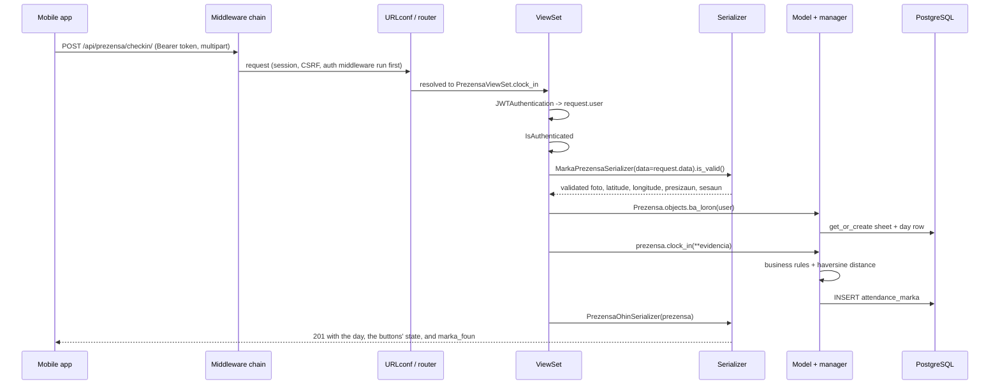

# ETI-Dili Attendance API

Backend for the ETI-Dili teacher attendance app. It replaces the paper book
*"LISTA PREZENSA BA PROFESÓR/A ETI DILI"* — a monthly sheet where every teacher
wrote four times a day and signed next to each one. In the app the time is
stamped by the server and the signature is replaced by a photo plus GPS
coordinates captured at the moment of the punch.

The mobile client lives in the sibling folder `eti-mobile/`.

---

## System Flow

### 1. Entry point and bootstrap

There are two ways the project starts, and both converge on the same settings
module:

| Context | Entry point | What it does |
| --- | --- | --- |
| Development / management commands | `manage.py` | Sets `DJANGO_SETTINGS_MODULE=core.settings`, hands `sys.argv` to `execute_from_command_line` |
| Production | `core/wsgi.py` (`application`) | Same env var, then `get_wsgi_application()` — this is the callable Gunicorn/uWSGI serves |

`core/asgi.py` exists too, but nothing async is used yet, so WSGI is the path
to deploy behind.

Boot sequence, in order:

1. **`core/settings.py:26`** — `environ.Env.read_env(BASE_DIR / '.env')` loads
   the `.env` file. This must run *before* any `env(...)` call; without it
   `SECRET_KEY` raises `ImproperlyConfigured` and the process dies at import.
2. **Secrets and config are read from the environment** — `SECRET_KEY`,
   `DEBUG`, `ALLOWED_HOSTS`, the six `DB_*` variables, and the three
   `ESKOLA_*` geofence values. Nothing sensitive is committed.
3. **`INSTALLED_APPS`** registers `rest_framework`,
   `rest_framework_simplejwt.token_blacklist`, and the two project apps —
   `accounts` (identity) and `attendance` (the book).
4. **`AUTH_USER_MODEL = 'accounts.User'`** — read at model-loading time. Every
   `ForeignKey(settings.AUTH_USER_MODEL)` in `attendance` resolves through it.
5. **`ROOT_URLCONF = 'core.urls'`** — the URL tree is imported lazily on the
   first request.

`TIME_ZONE = 'Asia/Dili'` with `USE_TZ = True`. This matters more than it
looks: every punch time and the morning/afternoon session cut-off are computed
in **local Dili time**, while the database stores UTC.

### 2. How a request travels

Django has no "controller" or "service" layer by convention. The equivalent
stages here are **URLconf → middleware → viewset → serializer → model/manager →
ORM → PostgreSQL**, then back out through the serializer.



**Step by step:**

1. **Middleware** (`core/settings.py:84`) — the default Django chain: security
   headers, session, common, CSRF, auth, messages, clickjacking. It runs on
   every request, but note what it does *not* do: it does **not** authenticate
   the API. `AuthenticationMiddleware` only populates `request.user` from a
   *session cookie*; the mobile app never has one, so at this stage
   `request.user` is `AnonymousUser`.

2. **URL routing** — `core/urls.py` splits the tree three ways:

   | Prefix | Included from | Purpose |
   | --- | --- | --- |
   | `/admin/` | `django.contrib.admin` | Django admin (no models registered yet) |
   | `/api/auth/` | `accounts/urls.py` | login, logout, refresh, verify, me |
   | `/api/` | `attendance/urls.py` | `prezensa` and `lista-prezensa` routers |

   Under `DEBUG`, `core/urls.py:29` also serves `/media/` so punch photos are
   viewable locally. **In production the web server must serve `MEDIA_ROOT`
   instead — this line is a no-op when `DEBUG=False`.**

   `attendance/urls.py` uses a DRF `DefaultRouter`, so `PrezensaViewSet`
   expands into `list`, `retrieve`, and five `@action`s: `ohin`,
   `istoria`, `checkin`, `checkout`, and `ohin-hotu`.

   `ohin-hotu` is the **only** endpoint that reads more than one teacher's
   data, so it is the only one carrying an extra permission
   (`accounts.permissions.EhAdmin` — staff or `role=ADMIN`). Everything else
   is scoped to `request.user` by its queryset.

3. **Authentication and permission, inside the view** — DRF, not middleware,
   authenticates. `DEFAULT_AUTHENTICATION_CLASSES` runs `JWTAuthentication`,
   which reads the `Authorization: Bearer <access>` header, verifies the
   signature and expiry, and sets `request.user`. `DEFAULT_PERMISSION_CLASSES`
   is `IsAuthenticated` **globally**, so every endpoint is closed by default
   and a new view is private unless someone deliberately opens it.

4. **ViewSet — the thin layer.** `attendance/views.py` does four things only:
   validate input, fetch or create today's row, call a model method, serialize
   the result. It contains no attendance rules. Note
   `parser_classes = [MultiPartParser, FormParser]`, required because punches
   upload a photo.

5. **Serializer — the boundary.** `MarkaPrezensaSerializer`
   (`attendance/serializers.py`) validates the punch payload: photo required,
   latitude/longitude required and range-checked, `presizaun` and `sesaun`
   optional. Output serializers are entirely read-only — the API never lets a
   client write a time directly.

6. **Model and manager — where the rules live.** `Prezensa.objects.ba_loron()`
   is the only way a day row is created: it `get_or_create`s the monthly
   `ListaPrezensa` *and* the `Prezensa` row, so the first punch of a month
   opens the sheet with no separate setup step. `Prezensa._rejistu()` then
   enforces the rules — no duplicate punch in a session, no clock-out before
   clock-in, no Saturday afternoon, the teacher inside the school's 100 m
   radius, and evidence always attached — and raises `ValidationError` with a
   `code` the view maps to a `400`.

7. **Database** — a single `INSERT` into `attendance_marka`. `Marka.save()`
   first computes `distansia_metru` and `iha_eskola` from the coordinates, so
   the geofence result is stored once rather than recalculated on every read.

8. **Response** — `PrezensaOhinSerializer` returns the whole day (the four
   book columns, rebuilt from the punches by the `oras_*` properties), the
   state of the two buttons (`bele_clock_in` / `bele_clock_out`), and
   `marka_foun`, the punch just created. `201` on success; `400` with
   `{detail, code}` on a rule violation.

**Queries are always scoped to the caller.** Both viewsets filter by
`request.user` in `get_queryset()`, so one teacher can never read another's
attendance — including by guessing an id in the URL.

### 3. Authentication flow

Login is by **email**, not username — `accounts/models.py` sets
`USERNAME_FIELD = 'email'` and removes `username` entirely.

#### Login — `POST /api/auth/login/`

1. `LoginView` (subclass of simple-jwt's `TokenObtainPairView`) receives
   `email` + `password`.
2. `LoginSerializer.validate()` calls Django's `authenticate()`, which runs the
   configured password hasher against `User.password`.
3. On success a **refresh** and an **access** token are signed with
   `SECRET_KEY` (HS256). `get_token()` embeds `naran_kompletu` and `role` as
   custom claims, so the app can render its header without decoding anything
   else.
4. `validate()` attaches the serialized user — email, `numeru_id`,
   `naran_kompletu`, `kargu`, and an **absolute** `foto` URL — so the home
   screen needs no second request.
5. `UPDATE_LAST_LOGIN = True` writes `last_login`.

Failure returns `401` and no token.

#### Validating a token — every subsequent request

`JWTAuthentication` verifies signature and `exp`, then loads the user by the
`user_id` claim. **This is stateless**: no database lookup of the token itself,
which is why a *blacklisted access* token still works until it expires.

#### Refresh — `POST /api/auth/refresh/`

With `ROTATE_REFRESH_TOKENS` and `BLACKLIST_AFTER_ROTATION` both on, one
refresh returns a **new access *and* a new refresh** token and blacklists the
one just used. A copied refresh token therefore dies the moment the real device
refreshes.

Because a rotated token gets a full new lifetime, `REFRESH_TOKEN_LIFETIME`
behaves as an **idle timeout**, not a re-login deadline.

| Token | Lifetime | Meaning |
| --- | --- | --- |
| Access | 15 minutes | Max window for a leaked token; also the lag before logout truly bites |
| Refresh | 30 days | How long a device may sit unused before the teacher must log in again |

#### Logout — `POST /api/auth/logout/`

Requires a valid access token, takes the `refresh` token in the body, and calls
`RefreshToken(...).blacklist()` — a row in `token_blacklist_blacklistedtoken`.
Returns `205`; a malformed or already-blacklisted token returns `400` with
`code: token_not_valid`.

> **Known limitation:** blacklisting revokes the *refresh* token only. The
> access token already issued stays valid for up to 15 more minutes. This is
> inherent to stateless JWT; removing it would mean a database check on every
> request, which is exactly the cost JWT is being paid to avoid.

Client contract: on `401`, call `/api/auth/refresh/`, retry once, and if the
refresh also fails, send the user back to the login screen.

### 4. Background processes

**There are none.** No Celery, no queue, no scheduler, no cron entries, no
signals doing deferred work. Every write happens inside the request that caused
it, which is why the API can be deployed as a plain WSGI process with nothing
else beside it.

One piece of **recommended** housekeeping is not yet scheduled:

```bash
python manage.py flushexpiredtokens   # weekly
```

Token rotation writes a row per refresh (~57 teachers × 2–4 refreshes/day
≈ 70k rows/year). Nothing breaks without it, the table simply grows. This must
be registered on the deployment host (cron or Task Scheduler).

If future work adds photo compression, monthly PDF export of the sheet, or push
notifications for the "Notifikasaun" tab, those are the first things that would
justify introducing a worker.

### 5. External services

The surface is deliberately small — one external dependency, no third-party
APIs, no payment gateways.

| Service | How it connects | Configured by |
| --- | --- | --- |
| **PostgreSQL** | Django ORM over `psycopg` 3, sync connection per request | `DB_ENGINE`, `DB_NAME`, `DB_USER`, `DB_PASSWORD`, `DB_HOST`, `DB_PORT` in `.env` |
| **Media storage** | Local filesystem at `MEDIA_ROOT` (`BASE_DIR/media`) | `MEDIA_URL`, `MEDIA_ROOT` |
| **Mobile client** | HTTPS JSON + multipart; JWT bearer auth | `ALLOWED_HOSTS` |

Two things that look like external services but are not:

- **Geolocation.** Distance from the school is computed in-process by a
  haversine formula in `attendance/geo.py`. There is no Google Maps call, no
  reverse geocoding, and no GeoDjango/PostGIS dependency — the app only needs
  a point-to-point distance. The school sits at
  `-8.552336, 125.541603` (`ESKOLA_LATITUDE` / `ESKOLA_LONGITUDE`) with a
  `ESKOLA_RAIU_METRU` of 100 m. **A punch outside that radius is refused**
  with `code: dook_husi_eskola` and the measured distance, so a teacher has to
  be at the school to clock in or out. Two safety valves: the check is skipped
  entirely when no coordinates are configured, and `ESKOLA_OBRIGA_FATIN=False`
  in `.env` reverts to recording out-of-radius punches with
  `iha_eskola: false` instead of refusing them — no deploy needed if the
  radius turns out to be too tight in the field.
- **Photos.** Uploaded through the same multipart request, written to disk by
  Django's storage backend, and served back as URLs. Moving to S3 later means
  changing `STORAGES` only — no calling code would change.

**Before production:** set `DEBUG=False`, fill `ALLOWED_HOSTS`, serve
`MEDIA_ROOT` from the web server, and terminate TLS — bearer tokens and punch
photos must never cross plain HTTP.

### Walkthrough: one morning clock-in

The shortest path through every layer above.

1. Teacher opens the app. It holds a refresh token from a previous day; the
   access token is long expired, so it calls `/api/auth/refresh/` and gets a
   fresh pair (the old refresh token is blacklisted).
2. `GET /api/prezensa/ohin/` → `ba_loron()` creates the February 2026 sheet and
   the row for the 18th if this is the first punch of the month. Response says
   `bele_clock_in: true`, `bele_clock_out: false`.
3. Teacher takes a selfie and presses **Clock In**. The app POSTs the photo and
   the device's coordinates to `/api/prezensa/checkin/`.
4. `JWTAuthentication` resolves the user; `MarkaPrezensaSerializer` validates
   the payload; `Prezensa.clock_in()` sees the time is before 13:00, so the
   punch belongs to the **DADER** session and the **TAMA** column.
5. Rules pass, `Marka` is inserted, `distansia_metru` computes to 0 m and
   `iha_eskola` to `true`.
6. `201` comes back with `marka_foun.kolumna = "ORAS_DADER_TAMA"`,
   `oras_orariu = "08:00:00"`, and `atrazadu = true` because the punch landed
   at 08:03. The app flips the buttons: Clock In disabled, Clock out enabled.
